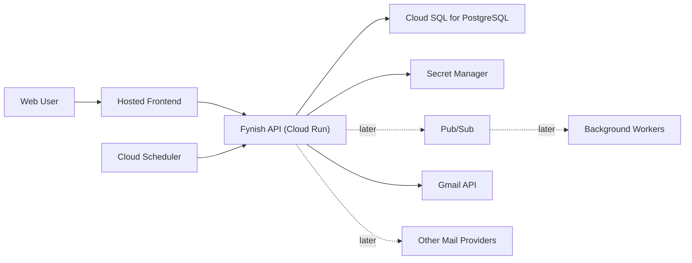

# Future Platform Roadmap

## Purpose

This document captures the next major platform directions for Fynish beyond the current local-first prototype:

1. run continuously in Google Cloud
2. support multiple end users
3. support email providers beyond Gmail
4. publish the project to GitHub so other developers can contribute safely

It is intentionally high-level and architectural. The goal is to help sequence the work, identify structural refactors that should happen early, and avoid locking the current prototype into Gmail-only or single-user assumptions.

The first concrete implementation follow-up to this roadmap is documented in [docs/FOUNDATION_REFACTOR_SPEC.md](docs/FOUNDATION_REFACTOR_SPEC.md).

The current public roadmap focuses on product direction, provider boundaries, and implementation sequencing rather than deployment-specific runbooks.

A concrete V1 product exploration for turning an email into a Mac Things task is documented in [docs/SEND_TO_THINGS_V1_PLAN.md](docs/SEND_TO_THINGS_V1_PLAN.md).

Publication-readiness working notes are intentionally kept outside the public repository.

## Current state

Today Fynish is:

- a local FastAPI + React/Vite app
- backed by SQLite
- optimized around one operator using it on one machine
- able to connect multiple Gmail accounts for that operator
- able to run real Gmail read and gated Gmail write flows
- still carrying a mock harness for testing and experimentation

This is a strong V1 foundation, but it has a few deliberate constraints that matter for the next phase:

- the database is single-tenant in shape
- `accounts.email_address` is globally unique, not user-scoped
- `messages.account_email` is denormalized and not tied to a first-class user/account ownership model
- rules are effectively global today
- the Gmail integration is built directly into the app rather than behind a provider abstraction
- the app lifecycle assumes a local server rather than an always-on service

## Recommendation summary

Recommended order:

1. refactor the data model for multi-user ownership
2. introduce a provider abstraction layer
3. prepare the repository for GitHub collaboration
4. move the backend to Google Cloud
5. migrate from SQLite to PostgreSQL
6. add hosted authentication and user sessions
7. then expand to non-Gmail providers

The key point is:

- do not treat “move to Google Cloud” as only a deployment task
- the multi-user and multi-provider work changes the shape of the system more deeply than the hosting move itself
- publishing to GitHub should be treated as a small hardening milestone, not just a visibility step

## Feature 1: Run Continuously in Google Cloud

### Product meaning

This feature means:

- Fynish can sync and process mail even when your laptop is closed
- reminder generation and future scheduled jobs can run on a real server schedule
- users can access the app through a hosted web URL instead of `localhost`

### Recommended Google Cloud target architecture

Recommended first hosted architecture:

- frontend: static build served via Cloud Run or Cloud Storage + HTTPS load balancer
- backend API: Cloud Run service
- database: Cloud SQL for PostgreSQL
- secrets: Secret Manager
- scheduled jobs: Cloud Scheduler
- async/event work later: Pub/Sub

Why this is the best fit:

- Cloud Run is a good match for FastAPI and containerized stateless APIs. Google documents that Cloud Run services autoscale and scale to zero by default, with optional minimum instances if needed. [Cloud Run autoscaling](https://cloud.google.com/run/docs/about-instance-autoscaling)
- Cloud SQL for PostgreSQL is the natural upgrade path from SQLite because it preserves a relational model while adding managed availability, backups, and concurrency. [Cloud SQL for PostgreSQL](https://cloud.google.com/sql/docs/postgres/)
- Secret Manager is the right place for OAuth client secrets, provider credentials, encryption keys, and service configuration. [Secret Manager overview](https://docs.cloud.google.com/secret-manager/docs/overview)
- Cloud Scheduler is the natural replacement for local reminder scheduling and sync heartbeat jobs. Google documents it as a cron-style scheduler targeting HTTP endpoints or Pub/Sub. [Cloud Scheduler overview](https://docs.cloud.google.com/scheduler/docs/overview)
- Pub/Sub is a good later addition once sync/import/processing jobs should be decoupled from request/response APIs. [Pub/Sub overview](https://docs.cloud.google.com/pubsub/docs/overview)

### Hosted architecture shape



### Hosting implications

Moving to Google Cloud is not only “deploy current code.”

It also implies:

- replacing local file token storage with secure cloud storage patterns
- replacing SQLite with a multi-connection database
- introducing proper session/auth handling for end users
- deciding whether sync work runs inline, on a schedule, or in background jobs

### Scaling considerations

For the expected near-term size of this product, such as friends-and-family usage or dozens of users, the main scaling pressures are likely to be:

- Gmail API polling and quota usage
- number of connected accounts per user
- growth of processed-message history and action logs
- scheduled sync concurrency

The current storage pattern is relatively lightweight:

- metadata
- labels
- classification results
- action logs
- limited `body_preview`

The app does **not** currently store full attachments or full raw mailbox archives, which is favorable for early scaling.

Recommended early guardrails:

- move to PostgreSQL before real hosted multi-user rollout
- add clear retention decisions for processed message history and logs
- index hot query paths well
- keep sync idempotent and account-scoped
- treat Gmail API quota behavior as an operational constraint from the beginning

### Risks if done too early

If Fynish is hosted before the data model and auth model are refactored, the hosted app will still behave like a single-user local tool, just in the cloud. That would create migration rework almost immediately.

### Suggested milestone order for cloud move

1. refactor schema for multi-user ownership
2. switch to PostgreSQL locally or in a dev cloud environment
3. containerize backend for Cloud Run
4. move secrets to Secret Manager
5. deploy preview environment
6. add Cloud Scheduler for sync/reminder jobs

## Feature 2: Multi-user support

### Product meaning

This feature means:

- you can create accounts for other people
- each person can connect their own email accounts
- their messages, rules, settings, and reminders are isolated from each other
- admins may later manage or support user accounts

### Why this is the deepest structural change

The current prototype is operator-centric, not tenant-centric.

Today:

- rules are global by default
- `accounts.email_address` is unique globally
- messages reference `account_email` directly
- there is no `users` table or organization model
- there is no concept of ownership, role, or membership

So multi-user support is not a “login screen” feature. It requires a real tenant and ownership model.

### Recommended data model direction

Introduce these core entities:

- `users`
- `workspaces` or `organizations` (optional at first, but useful if you may manage families/teams later)
- `mail_accounts`
- `provider_connections`
- `messages`
- `rules`
- `notification_settings`
- `actions_log`

Recommended ownership shape:

- one `user` owns many `mail_accounts`
- one `mail_account` belongs to exactly one `user`
- messages belong to `mail_account_id`
- rules belong to either:
  - `user_id` scope, or
  - `mail_account_id` scope

### Recommended schema direction

Move away from:

- `messages.account_email`
- `accounts.email_address` as the primary join mechanism

Move toward:

- `users.id`
- `mail_accounts.id`
- foreign-key relationships everywhere

High-level target shape:

```text
users
  id
  email
  display_name
  auth_provider
  created_at
  updated_at

mail_accounts
  id
  user_id
  provider
  external_account_email
  status
  last_sync_at
  created_at
  updated_at

provider_connections
  id
  mail_account_id
  provider
  credentials_ref
  scopes_json
  created_at
  updated_at

messages
  id
  mail_account_id
  provider_message_id
  provider_thread_id
  ...

rules
  id
  user_id
  mail_account_id nullable
  scope
  rule_type
  pattern
  action
  ...
```

### Authentication recommendation

For Google Cloud-native hosted auth, Identity Platform is the most natural fit. Google documents it as a service for authenticating users to apps and services, including multi-tenant SaaS scenarios. [Identity Platform docs](https://cloud.google.com/identity-platform/docs) and [multi-tenancy/auth concepts](https://docs.cloud.google.com/identity-platform/docs/concepts-authentication)

Recommended auth path:

- hosted frontend authenticates users via Identity Platform
- backend verifies ID tokens
- backend authorizes access to only the caller’s `mail_accounts`, `messages`, `rules`, and settings

### Multi-user rule strategy

Today rules are effectively global.

For multi-user, I recommend:

- default rules become user-scoped
- optional account-scoped rules are supported
- no cross-user rule sharing by default
- future “shared rule packs” can exist as a separate concept if desired

### Multi-user risks

- data leakage if ownership is added late or inconsistently
- rule auto-processing becomes dangerous if rules are not clearly scoped
- reminder jobs need clear user/account targeting
- support/admin features become messy without a clean ownership model

## Feature 3: Support providers beyond Gmail

### Product meaning

This feature means:

- Fynish should not assume Gmail-only APIs, labels, or OAuth flows
- Outlook/Microsoft 365, IMAP-based providers, and possibly other APIs can be added later

### Why provider abstraction should happen before provider expansion

The app currently contains Gmail-specific assumptions in important places:

- message ids and thread ids are named with Gmail semantics
- Gmail labels are stored directly
- action planning is implemented as Gmail label add/remove behavior
- provider connections are stored in `gmail_account_connections`

To support more providers cleanly, introduce a provider abstraction layer before adding a second provider.

### Recommended provider abstraction

Define an interface like:

```text
MailProvider
  connect()
  list_unread_inbox_messages()
  fetch_message()
  apply_action_plan()
  validate_write_plan()
  refresh_credentials()
```

Then implement:

- `GmailProvider`
- later `MicrosoftGraphProvider`
- later `ImapProvider`

### Internal normalized message model

Provider-specific APIs should map into one internal canonical message model.

Example normalized fields:

- `provider_message_id`
- `provider_thread_id`
- `mail_account_id`
- `sender`
- `sender_domain`
- `reply_to`
- `recipient_to`
- `recipient_cc`
- `subject`
- `received_at`
- `snippet`
- `body_preview`
- `provider_labels_json`
- `headers_json`
- `has_attachments`

### Internal action model

Today actions are already conceptually normalized:

- `keep`
- `bulk_mail`
- `junk_review`
- `trash`
- `needs_review`

That is good.

What needs to change is the provider execution model.

Instead of directly thinking:

- add `Fynish/Trash`
- remove `INBOX`

the system should think:

- internal action = `trash`
- provider adapter translates that to provider-specific mailbox mutations

For Gmail that remains:

- add `Fynish/Trash`
- remove `INBOX`

For another provider, it may become:

- move to a folder
- add a category/tag
- archive

### Recommended provider roadmap

Do not jump straight from Gmail to many providers.

Recommended sequence:

1. abstract Gmail behind `GmailProvider`
2. rename Gmail-specific tables and services to provider-neutral names
3. support one second provider
4. only then generalize UI copy and account-management flows further

### Best likely second provider

The most practical second provider is Microsoft 365 / Outlook via Microsoft Graph, not generic IMAP.

Why:

- closer to Gmail in API quality and OAuth model
- easier to support structured actions than raw IMAP
- better fit for future hosted multi-user SaaS

IMAP is still useful later for breadth, but it is usually harder to make feature-parity consistent.

## Feature 4: Publish to GitHub for broader development

### Product meaning

This feature means:

- the project can be cloned and run by outside developers without private handholding
- secrets, OAuth artifacts, and local machine data are not accidentally published
- future contributors can help with cloud hosting, multi-user support, and provider support in parallel
- the repository clearly communicates what is production-ready, experimental, or still local-only

### Why this should happen before the larger platform push

Publishing to GitHub is a quality gate for the codebase. It forces the project to become easier to understand and safer to share.

This matters because Fynish now includes:

- real Gmail OAuth
- live Gmail write paths
- local token storage
- synthetic live-mail testing tools

Those are useful, but they also mean the repository should be explicit about:

- which files are secrets
- which tools are safe for contributors to run
- which behaviors are mock-only, read-only, dry-run, or live-write

### Recommended GitHub-readiness checklist

Before publishing, I recommend:

1. verify `.gitignore` covers:
   - `backend/google-credentials.json`
   - `backend/data/google_tokens/`
   - local database files that should stay machine-local
   - environment files and downloaded credential artifacts
2. document setup expectations:
   - Google OAuth prerequisites
   - live Gmail safety model
   - difference between mock, dry-run, and live-write flows
3. add contributor-facing documentation:
   - `docs/ARCHITECTURE.md`
   - `docs/CONTRIBUTING.md`
   - optional `docs/OPERATIONS.md`
4. add CI for:
   - backend tests
   - validation scripts
   - frontend build
5. decide repository posture:
   - private collaborator repo first
   - or public open-source repo after one more hardening pass

### How this interacts with the other three features

- GitHub publication supports Google Cloud migration by making infrastructure work reviewable
- GitHub publication supports multi-user work by making schema and auth changes easier to review
- GitHub publication supports multi-provider work by making adapter interfaces easier to evolve collaboratively

## Cross-cutting changes required for all three features

These are the refactors that benefit every future feature, regardless of order.

### 1. Database migration

Move from SQLite to PostgreSQL.

Why:

- concurrent hosted access
- better migration story
- multi-user safety
- production-grade backups and availability

Recommended target:

- Cloud SQL for PostgreSQL

### 2. Provider-neutral naming

Rename or abstract:

- `gmail_account_connections` -> `provider_connections`
- `gmail_message_id` -> `provider_message_id`
- `gmail_thread_id` -> `provider_thread_id`
- `gmail_labels_json` -> `provider_labels_json`

This can be done via a migration layer so the frontend does not need to change all at once.

### 3. Credential storage

Move away from local token files on disk.

Recommended cloud pattern:

- store OAuth refresh tokens or encrypted provider credentials in Secret Manager or an encrypted database-backed credential vault pattern
- keep only references in the relational database

### 4. Background jobs

Introduce explicit background job boundaries for:

- periodic sync
- reminder generation
- provider refresh or reconciliation
- future bulk maintenance or cleanup tasks

Recommended first hosted scheduler:

- Cloud Scheduler hitting authenticated HTTP endpoints

Recommended later async system:

- Pub/Sub driven worker processing

### 5. Auditability

As soon as the app becomes multi-user and cloud-hosted, strengthen:

- action logs
- rule provenance
- auth audit trails
- provider write audit trails

This matters because Fynish is making mailbox changes on behalf of users.

### 6. Light scaling discipline

We do not need a separate large scaling project yet, but the roadmap should assume:

- dozens of users should be comfortably supportable
- mailbox sync work should remain bounded and incremental
- processed-message storage should not grow without retention thinking

In other words:

- do not over-engineer now
- but do avoid local-only assumptions that would make normal growth painful later

## Suggested implementation phases

### Phase A: Foundation refactor

Goal:

- prepare the codebase for hosted, multi-user, multi-provider evolution
- prepare the repository for GitHub collaboration

Work:

- introduce `users`
- introduce `mail_accounts`
- refactor message and rule ownership to ids instead of emails
- rename Gmail-specific storage to provider-neutral concepts
- add migrations
- harden repo docs and secret handling for publication

### Phase B: Cloud-ready backend

Goal:

- deploy the backend safely without changing the product too much

Work:

- move to PostgreSQL
- containerize backend
- deploy to Cloud Run
- move secrets to Secret Manager
- use a hosted frontend deployment path

### Phase C: Hosted auth and sessions

Goal:

- make the app truly multi-user

Work:

- add Identity Platform
- enforce resource ownership and authorization
- scope queue, rules, reminders, and settings by user

### Phase D: Hosted job execution

Goal:

- make sync and reminders always-on

Work:

- add Cloud Scheduler jobs
- add job endpoints or worker queue
- make sync and reminders idempotent

### Phase E: Provider abstraction

Goal:

- remove Gmail-only structural assumptions

Work:

- implement provider interface
- move Gmail logic into provider adapter
- normalize internal message/action model

### Phase F: Second provider

Goal:

- prove that the abstraction is real

Work:

- add Microsoft Graph provider
- extend account connection UI
- validate sync and action semantics on the second provider

## Recommended near-term next steps

The most sensible near-term planning sequence is:

1. create a schema migration plan from the current SQLite schema to a user/account/provider-neutral schema
2. introduce provider-neutral service interfaces while Gmail is still the only real provider
3. prepare the repository for GitHub collaboration and contributor onboarding
4. design a user/auth ownership model around Identity Platform
5. only then plan the first Google Cloud deployment

If we skip those steps and move directly to hosting, we will likely rework the database and auth boundaries immediately afterward.

## Immediate product next step

With the foundation refactor tickets now substantially complete, the next product-facing Gmail-first build sequence should be:

1. create a planning/spec doc for full message/thread read
2. implement a backend Gmail thread/message fetch endpoint
3. add a UI message detail view
4. later consider reply/forward after that works well

This is the best bridge from the current triage tool toward a richer Gmail client experience while still keeping the broader architecture provider-aware.

## Open questions

These decisions will affect how the roadmap should be finalized:

- Will Fynish remain a single-organization tool controlled by one admin, or should each user self-sign up?
- Should rules default to user scope, account scope, or both?
- Should “trusted auto-apply rules” remain user-local only, or can they later be shared?
- Is Microsoft 365 the likely second provider, or do you need IMAP breadth sooner?
- Should the hosted app be a private/internal tool first or a public-facing multi-tenant app?
- Should the first GitHub publication be private-for-collaborators or public?
- What contribution model is preferred: direct collaborators, forks + pull requests, or both?

## Recommendation in one sentence

Treat multi-user and provider abstraction as the real platform refactor, publish the repo in a contributor-safe form, and then use Google Cloud as the deployment target that comes immediately after those foundations are in place.

## Sources

These Google Cloud product references informed the hosted architecture recommendations:

- [Cloud Run autoscaling](https://cloud.google.com/run/docs/about-instance-autoscaling)
- [Cloud SQL for PostgreSQL](https://cloud.google.com/sql/docs/postgres/)
- [Secret Manager overview](https://docs.cloud.google.com/secret-manager/docs/overview)
- [Cloud Scheduler overview](https://docs.cloud.google.com/scheduler/docs/overview)
- [Pub/Sub overview](https://docs.cloud.google.com/pubsub/docs/overview)
- [Identity Platform documentation](https://cloud.google.com/identity-platform/docs)
- [Identity Platform authentication concepts](https://docs.cloud.google.com/identity-platform/docs/concepts-authentication)
